# Tech Challenge

## What You'll Make

### Our Goal
The goal of this challenge is to review some of the concepts learnt in the previous modules. Especially relating to the creation of multi-screen apps through the use of segues.

### What you will create
By the end of the module, you will have made beautiful bill splitting, tip calculating app. No one can work out $145.56 split between 5 people with a 20 percent tip. With your very own Tipsy app in hand, you’ll never need to do maths ever again!

## Step 1: Clone the Starting Project

Clone this project using Xcode.

First, take a look around the starting project. Notice that in our Main.storyboard there are two screens. One for the calculator and one for the result.

Next, notice that in the calculator screen, we have two new components a UITextField and a UIStepper.

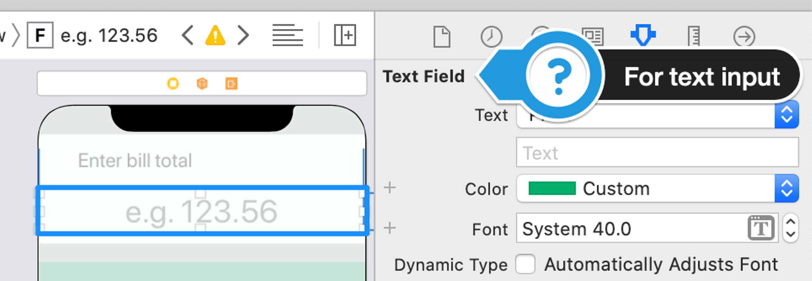
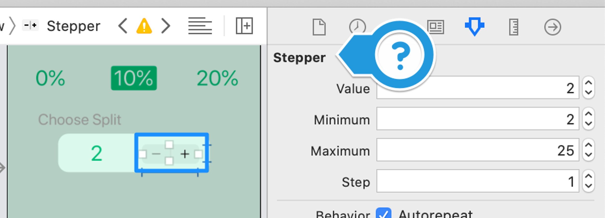

These were simply dragged into place from the Object Library like all of our other UI components.

## Step 2: Create IBActions and IBOutlets for the Calculator Screen

* Using the graphic below, create the indicated IBOutlets according to the prescribed names.
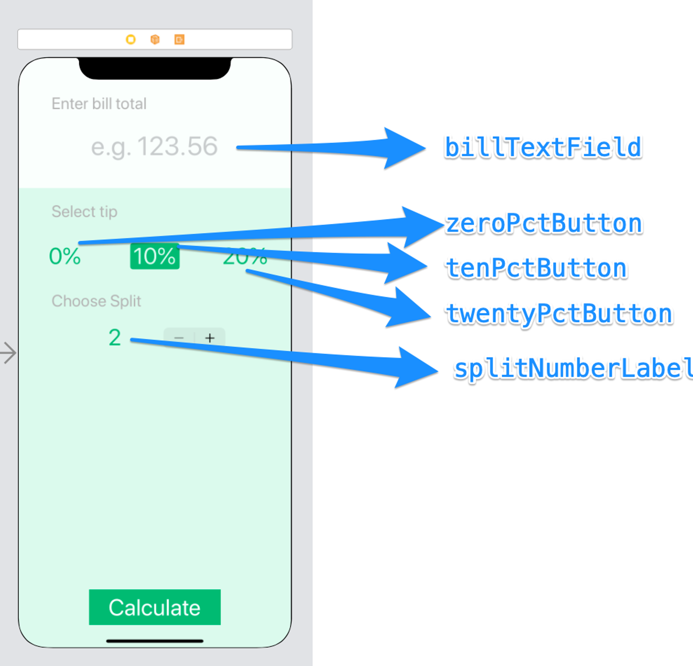

* Using the graphic below, create the indicated IBActions according to the prescribed names.
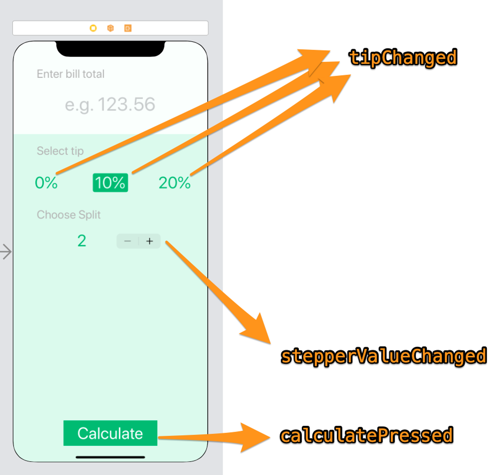

> NOTE: all three tip buttons should link to the same IBAction called tipChanged.

* Delete the entire viewDidLoad() method in ViewController.swift
By the end you should end up with a ViewController.swift file that looks like this:

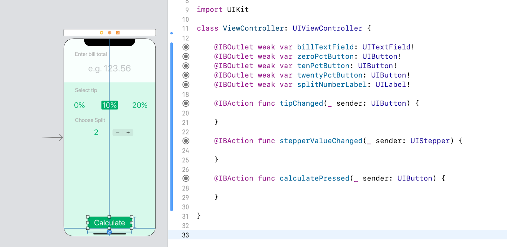

* Right click on the ViewController class name, select Refactor → Rename and change it to say CalculatorViewController instead.

## Step 3: Create IBActions and IBOutlets for the Results Screen
* Create a new Cocoa Touch Class file using File → New. Call it ResultsViewController and make it a subclass of UIViewController.

* Select both the ResultsViewController.swift and the CalculatorViewController.swift files and right-click to create a New Group from Selection. Call the new folder Controllers.

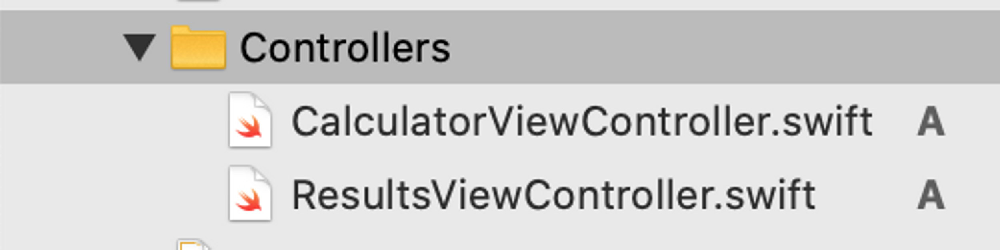

* Link the Results screen in the Main.storyboard with the new ResultsViewController class.

* You should now be able to click on the Automatic button in the Assistant to select the ResultsViewController.swift file to show it on the right side of the split view. (If you only see UIResponder.h when you click on Automatic, you might need to close down Xcode and restart).

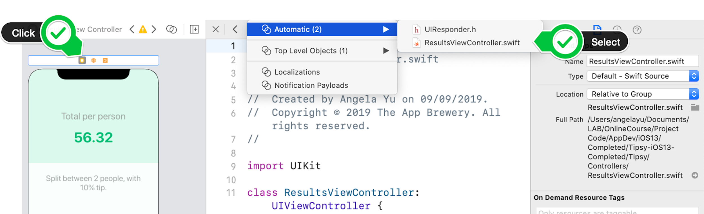

* Using the graphic below link up the necessary IBOutlets and IBActions according to their prescribed names.

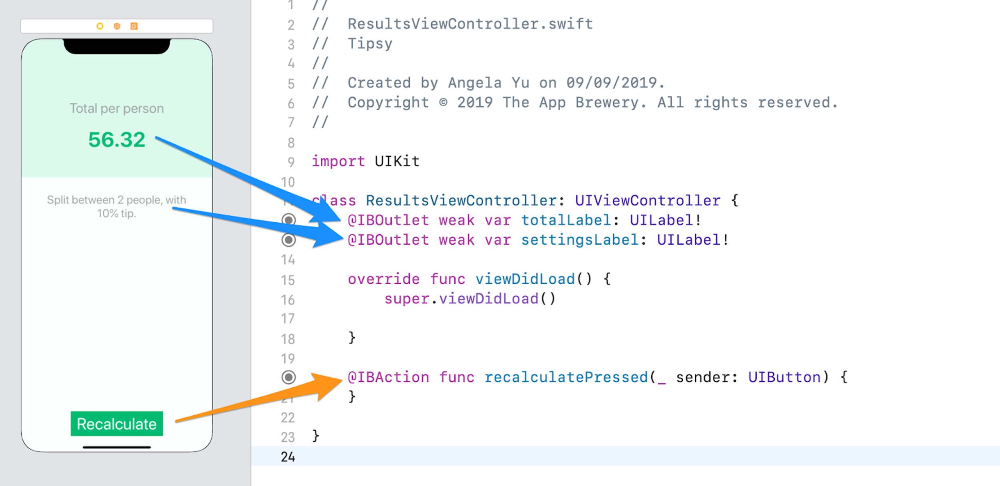

## Step 4: Figure out how much Tip to Apply

* You can use a property called isSelected to make a button have a background and appear selected. Try adding this code in the tipChanged IBAction and running the app. When you tap on any of the tip buttons, the zero percent button should become selected.

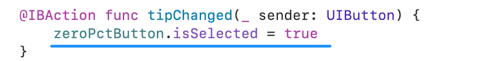

* Figure out how to make the tip button (zero/ten/twenty) that the user pressed become the selected button and make the others deselected.

* Figure out how to print the tip amount the user tapped on when the Calculate button is pressed. The tip percentage should be expressed as a decimal.

E.g. tap on 20% button, 20% button gets selected.
Next tap on the Calculate button, 0.2 gets printed in the console.

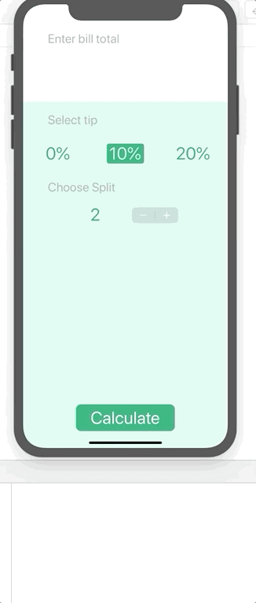

## Step 5: Figure out how Many People to Split the Bill Between

* Figure out how to make the stepper update the splitNumberLabel. If successful, you should see the number next to the stepper grow when you press on the + side and it should shrink if you press on the - side.

* Figure out how to print the number of people to split the bill between when the user taps on the Calculate button.

E.g. Tap on the stepper until the number 12 appears next to it.
Next tap on the Calculate button, 12 gets printed in the console.

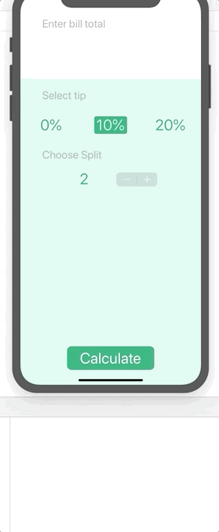

## Step 6: Calculate the Bill

* Figure out how to get the text that the user has inputted into the billTextField. Print what gets typed into the textfield when the Calculate button is pressed.

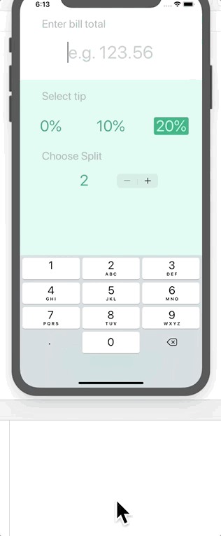

HINT: You can dismiss the keyboard by adding calling a method called endEditing(true) on the textfield. Trigger this code when the user taps on one of the tip values like so:

* Given that you now have access to the total bill amount, tip percentage and the number of people to split the bill between. Calculate the correct amount that each person should pay (to 2 decimal places) depended on their

E.g. Type 125.50 as the total bill in the billTextField.
Add a 20% tip
Split the bill between 5 people
Press the Calculate button and you should get the value 30.12 printed in the console.

## Step 7: Pass the Result to the ResultsViewController

* Figure out how to create a “Present Modally” segue between the CalculatorViewController and the ResultsViewController, so that when you press on the Calculate button, it triggers the segue and the screen transitions into the ResultsViewController. Then on the ResultsViewController, when you press the recalculate button it should go back to the previous CalculateViewController.

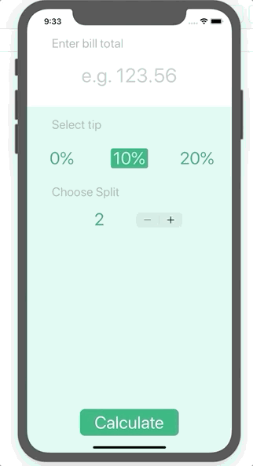

* Figure out how to pass the calculated result, numberOfPeople and tipPercentage over to the ResultsViewController and display it on screen.

## Deliverables

* [required] Please submit your solution in a PR form from your own fork and branch
* [required] As extra deriverable please submit a video link (or gif image) within your readme of the working app.
* [optional] You are free to improve the UI with any you consider a better practice or tool.
* [optional] You are free to change the layout with an autolayout approach.

> Compiled and structured by BlisS, creation attribution to angelabauer